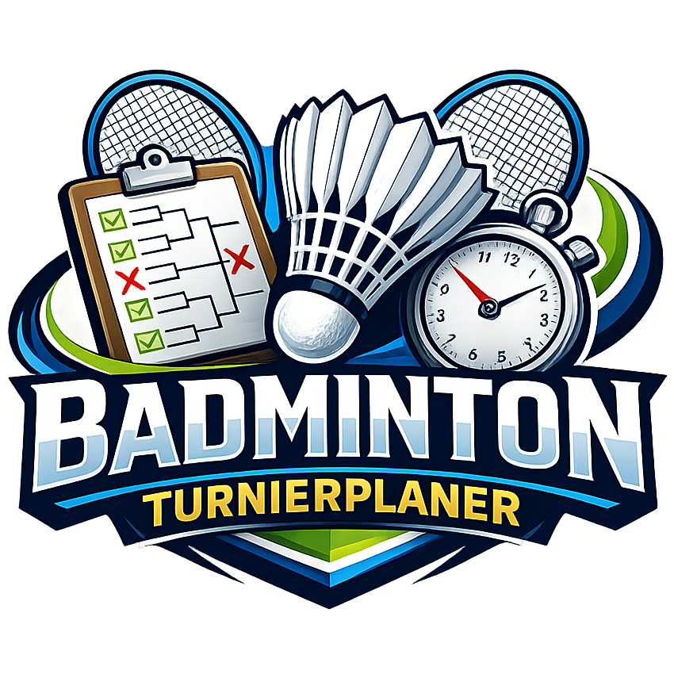
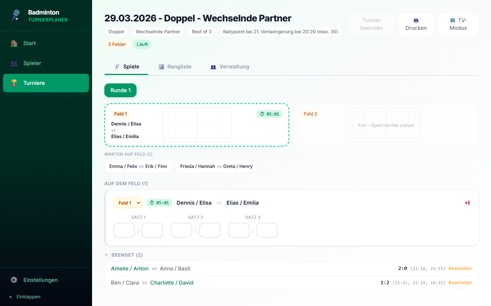
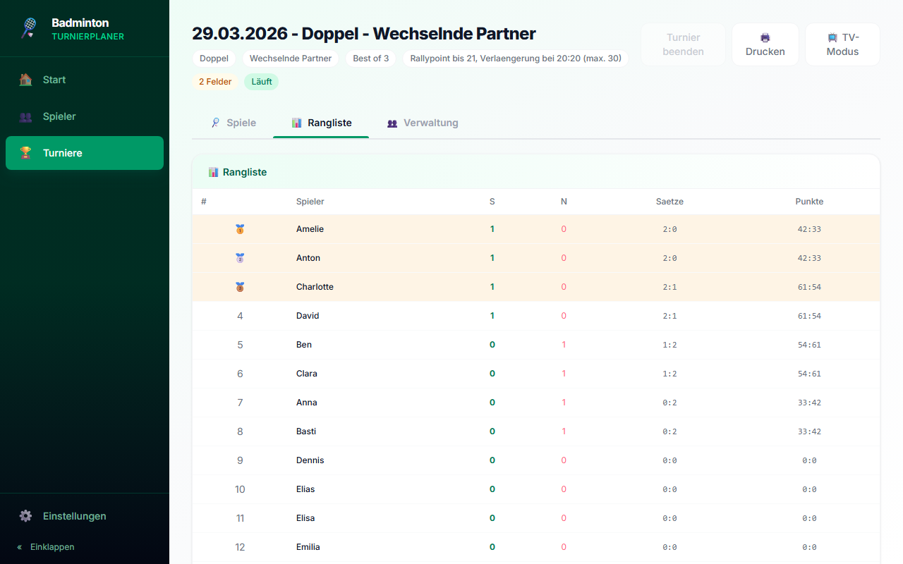
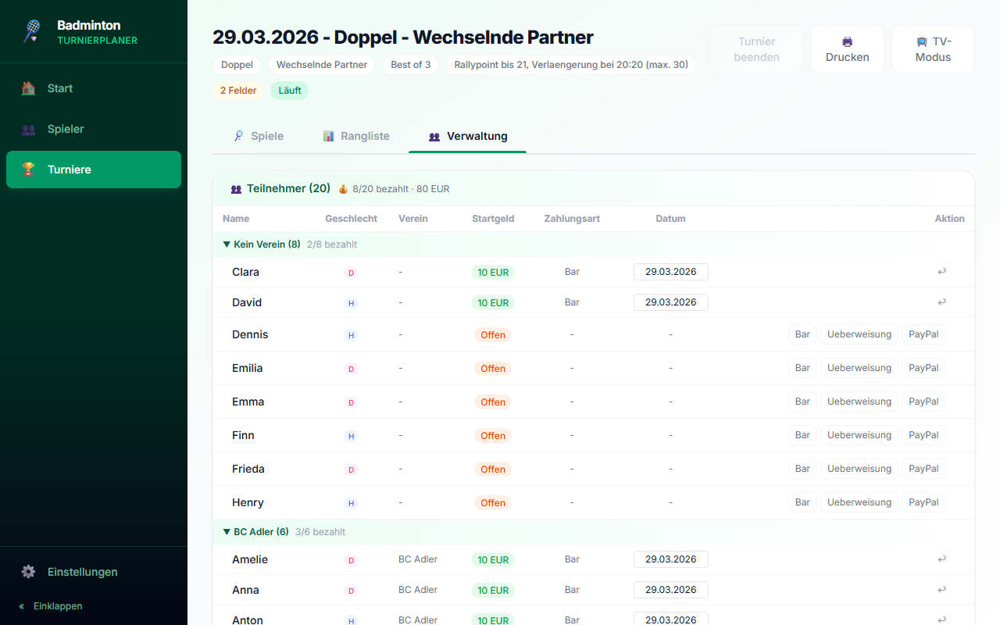
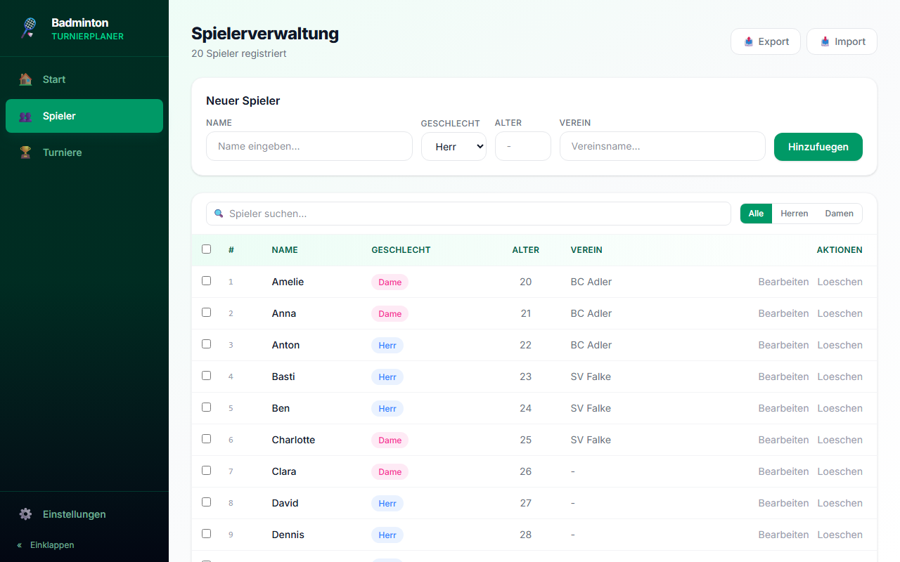
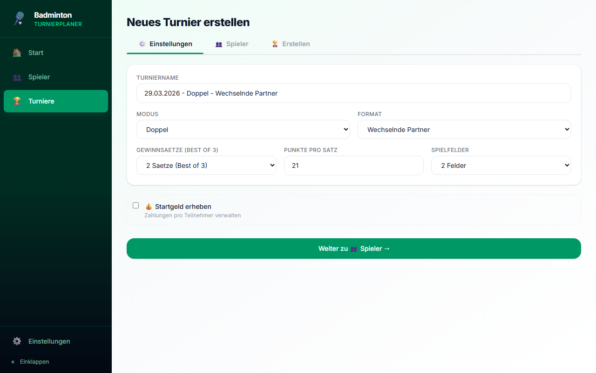

<p align="center">
  
</p>

<h1 align="center">BOSS - Badminton Operating &amp; Scheduling System</h1>

<p align="center">
  A desktop app for planning and running badminton tournaments.<br/>
  Built with <a href="https://tauri.app/">Tauri</a>, React and SQLite. Available in English and German.
</p>

<p align="center">
  <a href="README_DE.md">🇩🇪 Deutsche Version</a>
</p>

## Screenshots

| Matches | Standings |
|---|---|
|  |  |

| Management (Entry Fee + Players) | Player Management |
|---|---|
|  |  |

| Tournament Wizard |
|---|
|  |

## Features

### Tournament Management
- **3 Modes**: Singles, Doubles, Mixed
- **9 Formats**: Round Robin, Elimination (KO), Random Doubles, Group Stage + KO, Swiss System, Double Elimination, Monrad, King of the Court, Waterfall
- **Format Info Modal**: Detailed description, ASCII diagram, pros/cons for each format
- **Group Stage + KO**: Configurable group count (2-8), qualifiers per group (Top 1-4), then KO round
  - Singles: Individual players qualify
  - Doubles/Mixed: Fixed teams persist through group stage and KO
  - **Dynamic Tabs**: Group tables, KO bracket, standings as separate tabs
  - **Smart Queue**: "All Groups" mode shows matches from all groups simultaneously - no unnecessary waiting
  - **Group Buttons**: Navigate per group, line break between groups
  - **Print View**: Group tables with Q badge, separate group/KO headings
- **Swiss System**: Pairings based on current standings each round, no elimination, configurable round count
- **Double Elimination**: Winners + Losers bracket, lose twice to be eliminated, Grand Final
- **Monrad System**: Strict ranking-based pairing (#1 vs #2), popular in Scandinavia
- **King of the Court**: Winner stays on court, loser goes to back of queue, continuous play
- **Waterfall**: Players rotate through numbered courts, winners rise, losers fall
- **KO Bracket View**: Visual tournament tree as its own tab, possible participants in grey, confirmed winners immediately visible
- **Configurable**: Sets (Best of 1/3/5), points per set, courts (1-8)
- **Seeding**: Optional seeding for KO tournaments via Drag & Drop or arrow keys
- **Tournament Wizard**: Step-by-step creation with tab navigation (Settings -> Players -> Teams -> Seeding -> Create)
- **Manual Team Pairing**: Click-pairing for Doubles/Mixed - click two players to form a team
  - In Mixed mode: Women/Men in separate columns, same gender is greyed out
  - "Auto-assign remaining" for quick fill
  - Teams are persisted and restored when editing
- **Entry Fee Management**: Configurable per tournament (Singles/Doubles amount)
  - Payment status per player (Cash, Transfer, PayPal)
  - Payment date (editable)
  - Overview with total sum, grouped by club
- **Edit Tournament**: Draft tournaments fully editable (all wizard tabs)
- **Delete Tournament**: Draft tournaments deletable with confirmation dialog
- **Template System**: Export/import tournaments as JSON file
  - Selectable: Settings, Players, Teams (individually or combined)
  - Players are matched by name on import (ID-independent)
  - Teams are automatically remapped
- **Tab Navigation in Tournament**: Matches | Standings | Management
- **Archiving**: Archive and restore completed tournaments
- **Reopen Tournament**: Accidentally ended? Reopen completed tournaments
- **Injury/Retirement Undo**: Restore injured players for future rounds (walkovers remain)
- **Auto-Naming**: Tournament name automatically generated (Date - Mode - Format), editable

### Player Management
- Create, edit, delete players with **Date of Birth** (age calculated automatically, precise to the day) and **Club affiliation**
- **Excel Import** with column mapping (Name, Gender, Date of Birth/Age, Club) and fuzzy duplicate detection
- **Fuzzy Duplicate Detection**: Levenshtein-based similarity check catches near-matches (e.g. "Schmidt" vs "Schmitt")
- **Excel Import in Tournament Wizard**: Import players directly during tournament creation, all auto-selected
- **Excel Export** with native save dialog (incl. Date of Birth, Age + Club)
- **Entry Fee Tracking**: Paid amount (green) and open amount (red) visible in tournament management
- Gender filter and search function for player selection
- **Injury/Retirement**: Mark player as injured - excluded from remaining tournament
  - Styled modal dialog (no browser popup) with warning for team impact
  - With fixed teams: Partner is automatically excluded too
  - With random doubles: Only injured player is excluded
  - All open matches are scored as bye for the opponent

### Venue Management
- **Halls with individual court count**: Each venue has multiple halls, each hall its own courts
- Inline hall editor: Name + court count per hall, add/remove
- **JSON Export/Import**: Export and import venues as file
- **Tournament Integration**: Select venue when creating tournament -> Choose halls via checkbox
- **Grouped Court Display**: Courts in tournament grouped by hall with section headers
- **Default Halls in Settings**: Apply when no venue is selected

### Match Operations
- **Court Assignment**: Drag & Drop or double-click to assign matches to courts
  - Occupied courts are detected and blocked (consistent across rounds)
  - Double-click on waiting match: Court selection via popup (with 1 free court: direct assignment)
  - Double-click on occupied court: Scrolls to match and focuses first input field
  - Timer starts automatically on assignment, shows match duration in accent color
  - Score entry only possible after court assignment
- **Smart Match View**: Automatic sorting by status
  - "On Court": Running matches with full score entry
  - "Completed": Compact one-liners with set score + individual points (e.g. 2:0 (21:15, 21:18)), expandable
  - 3-second delay: Freshly completed matches stay visible briefly before sliding down
  - Edited matches stay in the completed section (no jumping up)
- **Score Entry**: Enter set results with auto-completion
- **Badminton Rules Compliant**: Rally point system to 21, extension at 20:20, cap at 30
- **Score Validation**: Invalid results are detected and marked
- **Fair Draw**: With odd player count, the player with most matches sits out; with random doubles, previous partnerships are weighted to avoid repetition
- **Tournament cannot be ended** while matches are still open

### TV/Projector Mode
- **Separate Window** optimized for landscape and readability from distance
- Opens maximized (movable to second monitor), not fullscreen
- **F11** = Fullscreen toggle, **Escape** = Close window
- Current court occupancy with live timer
- Queue: Next matches in order
- Recent results with winner highlighting and individual points
- Player announcement banner with animation ("Please go to court!")
- Adapts to selected color theme

### Standings & Evaluation
- **Live Standings**: Sorted by percentage-based match win rate, set win rate, point win rate
- **Group Tables**: In group stage, separate table per group with qualifier marking (Q)
- **Smart KO Qualification**: Configurable KO bracket size (4/8/16/32), auto-filled with best runners-up across groups
- **Team Standings**: In doubles group stage, teams (not individual players) are ranked
- **Medals**: Gold/Silver/Bronze for Top 3
- **Tournament Report**: Printable report with highlights (closest match, biggest win, most points)
- **Print View**: Match schedule, current round, standings or complete report
- **PDF Export**: Save tournament report as PDF file
- **Certificate Generator**: Festive certificates for Top 3 (gold border, BOSS branding, signature line)

### Statistics Dashboard
- **Tournament Overview**: Total tournaments by status, format distribution, mode distribution
- **Match Statistics**: Total completed matches, average/longest/shortest match duration, avg points per set, closest match
- **Court Utilization**: Courts used, matches per court, average time per court
- **Player Demographics**: Gender split, age distribution, top clubs
- **Player Rankings**: Cross-tournament rankings with win rate, points per match, medals for Top 3
- **Match Duration Tracking**: Automatic start/end timestamps for all matches

### Language
- **English** (Default) and **German** available
- Language selection in Settings -> Language
- Instant switch, persistently saved

### Design & Themes
- **4 Color Themes**: Emerald (Green), Sapphire (Blue), Amber (Orange), Dark (Dark Mode)
- Theme switch via Settings -> Design, applied instantly
- Full Dark Mode: All pages, modals, inputs, tables, bracket view
- **Font Size**: 7 levels (XXS to XXL), persistently saved
- Theme is persistently saved
- **Theme-aware Print View**: Print report adapts to selected color scheme
- **Default Logo**: BOSS logo in sidebar (centered), TV mode, favicon and app icon
- **Custom Club Logo**: Upload your own logo with crop tool (1:1 cropper)
  - Displayed in sidebar (with text) and in TV mode
  - Stored in SQLite database (included in backup, travels with DB)
- **Badminton Court SVG**: Subtle court background image on court cards

### Sidebar
- **Collapsible**: Reduce sidebar to icons for more space (persistently saved)
- Toggle button at bottom, tooltip when collapsed
- **Version Display**: Current app version at bottom of sidebar

### Settings
- **Updates**: Manual update check via GitHub Releases with progress bar and auto-restart
- **Language**: English / German selection
- **Design**: 4 color schemes (expandable), custom club logo with cropper
- **Defaults**: Default courts, timer thresholds (warning yellow, critical red)
- **Database**: Show/change storage location, backup & restore
- **Danger Zone**: Delete all players or tournaments (with safety confirmation)

### Keyboard Navigation
- **Enter/Tab**: Jump to next score field (Team1 -> Team2 -> next set -> next match)
- **Auto-Select**: On focus, field content is selected (immediately overwritable)
- Complete score entry without mouse possible

### Technical
- **Installer**: Choice between installation for all users (Program Files) or current user only
- **Auto-Update**: Automatic update check on app start (banner notification), manual check via Settings, signed updates from GitHub Releases
- **Offline-capable**: Runs completely locally, no internet needed (font bundled locally)
- **Cross-Platform**: Windows + macOS Intel + macOS Apple Silicon (native builds via GitHub Actions CI/CD)
- **SQLite Database**: Robust, persistent data storage
- **Backup & Restore**: Save and restore database with native dialog
- **Configurable Storage Location**: Database at any location (e.g. USB stick)

## Tech Stack

| Component | Technology |
|---|---|
| Desktop Framework | [Tauri 2](https://tauri.app/) (Rust) |
| Frontend | React 18 + TypeScript |
| Styling | Tailwind CSS 4 |
| Database | SQLite (via tauri-plugin-sql) |
| Build Tool | Vite |
| Excel | SheetJS (xlsx) |
| Font | Inter (bundled locally) |

## Prerequisites

For development:

- [Node.js](https://nodejs.org/) (v18+)
- [Rust](https://rustup.rs/) (stable)
- [Visual Studio Build Tools](https://visualstudio.microsoft.com/downloads/) with C++ Workload (Windows)

For using the app:

- Windows 10/11 (x64) or macOS
- WebView2 Runtime (pre-installed on Windows 10/11)

## Development

```bash
# Install dependencies
npm install

# Start development server (opens desktop window)
npx tauri dev

# Create release build
npx tauri build
```

The first build takes a few minutes as Rust compiles all dependencies. Subsequent builds are much faster.

## Build Output

After `npx tauri build`, the installers are located at:

```
src-tauri/target/release/bundle/
├── nsis/  → BOSS_x64-setup.exe
└── msi/   → BOSS_x64_en-US.msi
```

## Project Structure

```
src/
├── components/
│   ├── layout/        # Sidebar, Layout
│   ├── bracket/       # KO Bracket Visualization
│   ├── courts/        # Court Overview, Timer
│   ├── players/       # Excel Import
│   ├── print/         # Print View, Tournament Report
│   └── tournament/    # Extracted Tournament Components
├── hooks/
│   └── useTimer.ts    # Court Timer Hook
├── lib/
│   ├── db.ts          # SQLite Wrapper + LocalStorage Fallback
│   ├── draw.ts        # Draw Algorithms (Round Robin, KO, Groups, Random Doubles, Mixed, Seeding)
│   ├── scoring.ts     # Score Calculation, Validation, Auto-Fill, Team Standings
│   ├── highlights.ts  # Tournament Highlights (closest match, etc.)
│   ├── theme.ts       # Theme Definitions (4 color schemes)
│   ├── ThemeContext.tsx # React Context for Theme System
│   ├── I18nContext.tsx # React Context for Internationalization
│   ├── i18n/          # Translation files (en.ts, de.ts)
│   └── types.ts       # TypeScript Interfaces
├── pages/
│   ├── Home.tsx        # Dashboard
│   ├── Players.tsx     # Player Management
│   ├── Sportstaetten.tsx # Venues with Halls
│   ├── Tournaments.tsx # Tournament List + Archive
│   ├── TournamentCreate.tsx # Tournament Creation
│   ├── TournamentView.tsx   # Tournament View (Matches, Courts, Standings)
│   ├── TvMode.tsx      # TV/Projector Mode
│   └── Settings.tsx    # Settings (Language, Design, DB, Defaults)
└── App.tsx

src-tauri/
├── src/lib.rs         # Rust Backend (DB Migrations, Backup, Storage Location)
├── Cargo.toml
└── tauri.conf.json
```

## License

MIT
